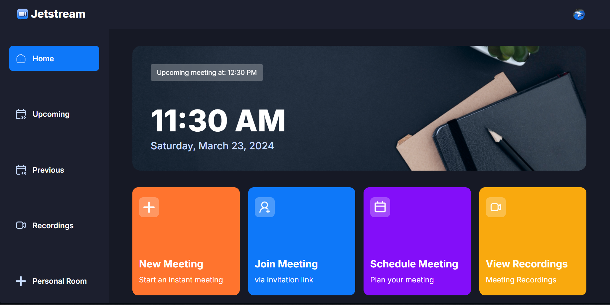

# Jetstream



> Modern Video Conferencing App

---

## 📖 Overview
Jetstream is a powerful and modern video conferencing application inspired by Zoom.  
Built with **Next.js 14**, **TypeScript**, and **Shadcn UI**, Jetstream offers a seamless, scalable, and responsive experience for virtual meetings.

---

## ✨ Features
- 🔷 **Next.js & TypeScript** – Leveraging cutting‑edge web technologies for performance and scalability.  
- 📱 **Responsive Design** – Optimized for desktops, tablets, and mobile devices.  
- ⚙️ **Intuitive Controls** – Simple, user‑friendly interface for managing meetings.  
- 💬 **Real‑Time Chat** – In‑meeting chat for instant communication.  
- 🎥 **HD Video & Screen Sharing** – Smooth, high‑quality conferencing with presentation support.  

---

## 🚀 Getting Started

### Prerequisites
- Node.js 18+
- npm or yarn

### Installation
```bash
git clone https://github.com/yourusername/jetstream.git
cd jetstream
npm install
npm run dev
